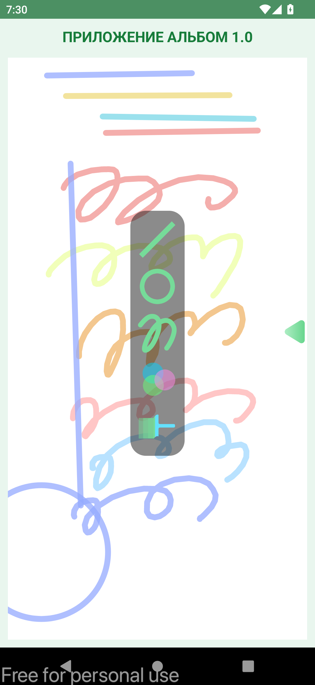
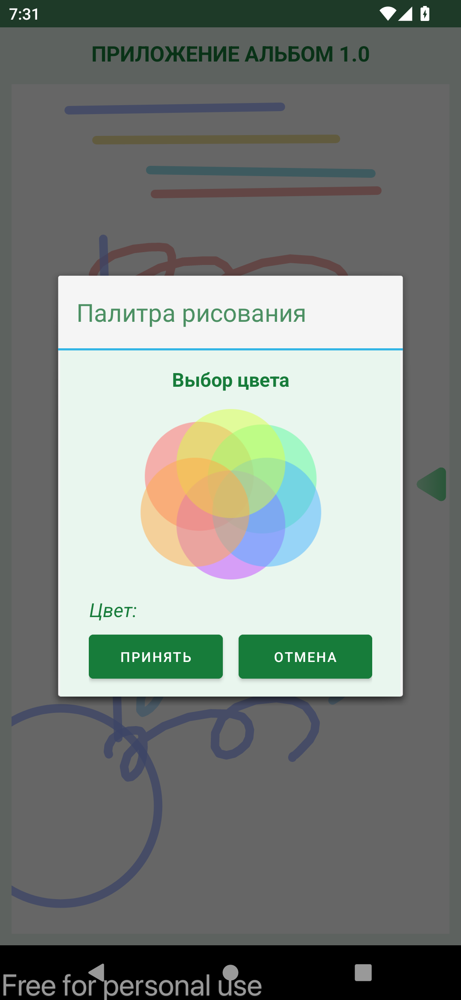

# Тема 2. Кастомизация представления View.

## Исходные данные
Имеется приложение текущего занятия

##  Домашнее задание No 2
Необходимо в функционал приложения добавить возможность отрисовки прямых линий

## Extra
- Добавлен возможность выбора цветов (палитра)
- Добавлено автозакрытие панели инструментов после выбора инструмента
- Текст вынесен в строковые ресурсы

